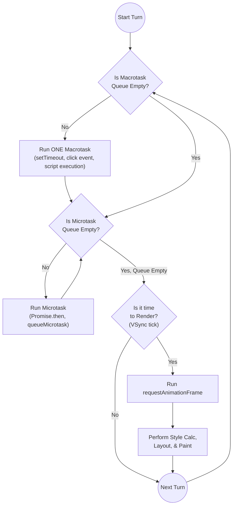
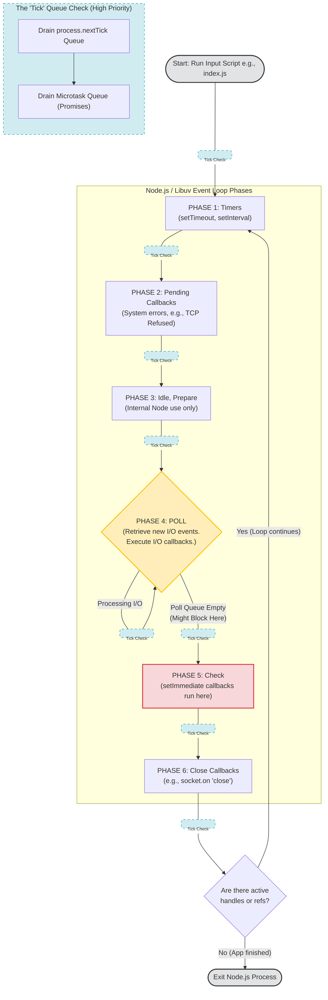

# 🌀 The Event Loop Masterclass: Browser vs. Node.js

> _Unmasking the single-threaded myth and mastering the asynchronous orchestration of JavaScript._
>
> **Note:** For Engine internals (V8, Hidden Classes) and Memory Management (Closures, GC), see [Closure.md](./Closure.md).

---

## 🤝 Part 1: The Shared Foundation

Despite their differences, both environments share these core principles:

1.  **Single JavaScript Thread:** User-written JS runs on one thread with one Call Stack.
2.  **Offloading Work:** Both rely on the host (Browser APIs or Libuv) to handle slow tasks (network, timers, disk) in the background.
3.  **The Queue Concept:** When background work finishes, a callback is pushed into a queue waiting for the main thread to be free.
4.  **Microtask Priority:** In both modern browsers and Node.js (v11+), the microtask queue must be **completely emptied** before moving to the next major task or phase.
5.  **Control Yielding:** Both environments now support yielding control back to the loop to prevent UI/I/O starvation (e.g., `setTimeout(0)` or the modern **`scheduler.yield()`**).

---

## 🏗 Part 2: The Multi-Threaded Reality of Node.js

### ❓ Is Node.js "Single-Threaded"?

- **The Nuanced Answer:** JavaScript execution is single-threaded (one call stack), but the **Node.js Runtime** is fundamentally multi-threaded.
- **The Main Thread:** Runs V8, the Call Stack, and the Event Loop orchestrator.
- **The Libuv Worker Pool:** A background thread pool (default: **4 threads**) that handles blocking or expensive OS tasks.
- **The Risk:** If you run a massive `while(true)` loop or recursive Fibonacci here, you **block the entire server**.

### ❓ The Libuv Worker Pool (The Hidden Threads)

Node.js = **V8 + Libuv**. Libuv implements a **Worker Pool** to handle operations that the OS doesn't provide non-blocking alternatives for.

- **The "4 Thread" Default:** By default, Libuv spins up 4 threads.
- **Tuning:** You can change this via `UV_THREADPOOL_SIZE=64 node app.js` (Max: 1024).

### ❓ What Tasks Go to the Worker Pool?

The main thread delegates slow/blocking operations to Libuv:

1.  **I/O-Bound (Expensive System Calls):**
    - **File System (`fs.*`):** Disk I/O is often blocking at the OS level. Libuv handles the `read()` call and notifies the loop when done. _(Note: fs.FSWatcher uses OS notifications like inotify, so it doesn't need the pool)._
    - **DNS Lookups (`dns.lookup`):** Resolving a domain involves blocking OS-level calls.
2.  **CPU-Intensive (C++ standard library tasks):**
    - **Crypto Module:** Functions like `pbkdf2()` are designed to be slow. Node offloads them so user logins don't block other requests.
    - **Zlib (Compression):** Gzipping large streams is CPU-heavy and handled in the pool.

### ❓ The 6-Step Workflow Summary

How Node handles an async task (e.g., `fs.readFile`):

1.  **Threads ≥ 5:** 1 Main thread + 4 Worker threads (minimum).
2.  **Delegation:** JS calls the async function.
3.  **Handoff:** Node's C++ bindings detect a "pool task" and give it to Libuv.
4.  **Execution:** A worker thread performs the blocking C++ code synchronously.
5.  **Completion:** The worker pushes the result/callback into the Event Loop's pending queue.
6.  **Notification:** The main thread, when free, picks up that callback and executes it.

### ❓ Beyond the Pool: `worker_threads`

- **Purpose:** Introduced to handle heavy JS math (image processing, encryption) without blocking the main loop.
- **Isolation:** Each worker has its own V8 instance and Event Loop.
- **Cost:** Memory-intensive. Use roughly one worker per CPU core.

---

## 🌐 Part 3: The Browser Event Loop (UI First)

### ❓ The Philosophy Difference

- **The Browser Loop** serves the **User Interface**. It prioritizes rendering and smoothness (~60fps).
- **The Node.js Loop** serves **High-Throughput I/O**. It is optimized for handling thousands of concurrent network/file connections.

### ❓ The Goal: Visual Responsiveness

The browser's event loop is orchestrated around the screen. Its goal is to ensure updates happen often enough (~60 frames per second) to create smooth motion.

### ❓ The Structure: The "Turn"

A single "turn" or tick of the browser loop follows a strict order, but with a critical nuance: **Microtasks run whenever the call stack becomes empty.**

1.  **Run ONE Macrotask:** The engine takes the oldest task (e.g., `setTimeout` callback, click handler, initial script execution) and runs it.
2.  **Drain Microtasks:** As soon as the stack is empty (even mid-task or after a macrotask), it processes **all** pending microtasks (Promises).
    - **Nuance:** If a microtask schedules another, it runs immediately—the loop won't move on until the queue is dry.
3.  **Starvation Hazard:**
    ```javascript
    function loop() {
      Promise.resolve().then(loop);
    }
    loop(); // Starves the event loop!
    ```
    The engine will stay in the Microtask phase forever, meaning the browser **never reaches the Render phase**. The UI freezes.
4.  **Render (Maybe):** The browser synchronizes with the display refresh (VSync).
    - **If it's time to render:** It executes `requestAnimationFrame` -> Style -> Layout -> Paint.
5.  **Loop:** Return to Step 1.

### 📊 Browser Loop Visualization



---

## 🟢 Part 4: The Node.js Event Loop (Libuv Phases)

### ❓ The 6 Phases of Libuv

Unlike the browser, Node moves through distinct sequential phases:

1.  **Timers:** `setTimeout`, `setInterval`.
2.  **Pending Callbacks:** System I/O errors (e.g., TCP connection refused).
3.  **Idle, Prepare:** Internal Node use.
4.  **Poll:** Most I/O happens here. **Node will block here** if the queue is empty and no timers are ready.
5.  **Check:** `setImmediate()` callbacks.
6.  **Close Callbacks:** `socket.on('close')`.

### ❓ The "Super Microtask": `process.nextTick()`

- Unique to Node.js.
- It runs **immediately** after the current operation, _before_ the Microtask queue (Promises) and _before_ the loop moves to the next phase.
- **Risk:** Recursively calling `nextTick` will starve the event loop entirely.

### ❓ `process.nextTick` vs. `queueMicrotask` (Final Boss Level)

While both are for "asynchronous" execution, they have different priorities in Node.js:

- **`process.nextTick`**: The "Super Microtask." It always runs **first**, before the microtask queue (Promises) and even before the loop moves to the next phase.
- **`queueMicrotask` (and Promises)**: Standard microtasks. They run after the current operation finishes but **after** the `nextTick` queue has been drained.
- **Starvation:** You can starve the event loop (and even Promises) by recursively calling `process.nextTick`.

### ❓ `setImmediate` vs. `setTimeout(..., 0)`

- **At Startup:** Order is non-deterministic (depends on CPU).
- **Inside I/O Callback:** `setImmediate` **always** runs first because the "Check" phase follows the "Poll" phase.

### 📊 Node.js Loop Visualization (Libuv)



---

## ⚖ Part 5: The Comparison Matrix

| Feature                | Browser Event Loop                | Node.js Event Loop          |
| :--------------------- | :-------------------------------- | :-------------------------- |
| **Primary Goal**       | UI Responsiveness / Rendering     | High-throughput I/O         |
| **Structure**          | Macrotask -> Microtasks -> Render | 6 Phased Cycles (Libuv)     |
| **Microtasks**         | After every Macrotask             | After every callback/phase  |
| **`process.nextTick`** | ❌ N/A                            | ✅ Runs **before** Promises |
| **`setImmediate`**     | ❌ N/A                            | ✅ Check Phase              |
| **Rendering**          | ✅ Core phase                     | ❌ N/A                      |

---

## 💡 Top Interview "Grilling" Questions

1.  **"What is the priority difference between `process.nextTick` and `queueMicrotask`?"**
    - _Ans:_ `process.nextTick` has higher priority. Node.js will drain the entire `nextTick` queue before even looking at the microtask queue where `queueMicrotask` and Promises live.
2.  **"Why is `process.nextTick` dangerous?"**
    - _Ans:_ It bypasses the event loop phases. If called recursively, it prevents the loop from ever reaching the Timers or Poll phases, effectively hanging the process.
3.  **"How does Node.js handle thousands of concurrent connections if it's single-threaded?"**
    - _Ans:_ It offloads the waiting (I/O) to the OS kernel (epoll/kqueue). The kernel notifies Libuv when data is ready, which then pushes a callback to the Poll phase. The "waiting" never blocks the thread.
4.  **"Where does `setImmediate` run compared to a Promise?"**
    - _Ans:_ In Node.js, Promises (Microtasks) run after the current operation/phase completes. `setImmediate` runs in the specific 'Check' phase. Microtasks always have higher priority than `setImmediate`.
