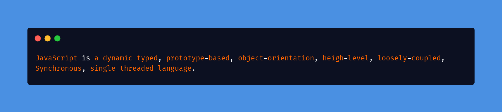

# 🚀 Ultimate JavaScript Interview Playbook

## 🧠 What is JavaScript?

**JavaScript** is a **high‑level**, **interpreted (JIT‑compiled)**, **dynamically & weekly typed**, **multi‑paradigm**, **prototype‑based**, **single‑threaded**, **event‑driven** language for building **web**, **mobile**, and **server‑side** applications.

It supports **object‑oriented**, **functional**, and **imperative** styles, and runs:
- In browsers via engines like **V8**, **SpiderMonkey**, **JavaScriptCore**
- On servers via **Node.js** (V8)

---

## 📚 Table of Contents

- [🚀 Ultimate JavaScript Interview Playbook](#-ultimate-javascript-interview-playbook)
  - [🧠 What is JavaScript?](#-what-is-javascript)
  - [📚 Table of Contents](#-table-of-contents)
  - [🔧 Core Characteristics](#-core-characteristics)
  - [🌍 Execution Environment](#-execution-environment)
    - [Browser Engines](#browser-engines)
    - [Server Runtime](#server-runtime)
  - [🧩 Advanced Internals](#-advanced-internals)
  - [🚀 ES6 → ES2025 Highlights](#-es6--es2025-highlights)
  - [🌐 Where JavaScript Is Used](#-where-javascript-is-used)
  - [📦 Core Topics to Master](#-core-topics-to-master)
    - [1. Language Deep Dive](#1-language-deep-dive)
    - [2. Execution Model](#2-execution-model)
    - [3. Asynchronous JavaScript](#3-asynchronous-javascript)
    - [4. Memory \& Performance](#4-memory--performance)
    - [5. Object System](#5-object-system)
    - [6. Data Types \& Coercion](#6-data-types--coercion)
    - [7 . Scopes \& Closures Practice](#7--scopes--closures-practice)
    - [8. Browser APIs](#8-browser-apis)
    - [9. Node.js Concepts](#9-nodejs-concepts)
    - [10. Advanced Patterns \& Techniques](#10-advanced-patterns--techniques)
    - [11. Testing, Debugging \& Tooling](#11-testing-debugging--tooling)
  - [🧪 JS Quiz Practice \& Resources](#-js-quiz-practice--resources)
    - [🔗 Links](#-links)
  - [💬 Discussion \& Issues](#-discussion--issues)
  - [🙌 Contribution \& License](#-contribution--license)

---

## 🔧 Core Characteristics

- **Dynamically Typed**: Variables are not bound to a specific type.
- **Weekly Typed**: Type coercion is allowed between incompatible types.
- **Prototype-based Inheritance**: Objects can inherit directly from other objects.
- **Single-threaded with Event Loop**: Uses **call stack**, **callback queue**/**task queue**/**macrotask queue**, and **microtask queue** to manage concurrency.
- **Lexical Scoping & Closures**: Functions have access to the scope in which they were defined.
- **Garbage Collected**: Automatic memory management.
- **JIT Compiled**: Modern JS engines (V8, SpiderMonkey) optimize execution using Just-in-Time compilation.

---

## 🌍 Execution Environment

### Browser Engines
- **V8** (Chrome, Edge)
- **SpiderMonkey** (Firefox)
- **JavaScriptCore** (Safari)

### Server Runtime
- **Node.js** (V8)
- APIs: modules, streams, clusters, process, filesystem

---

## 🧩 Advanced Internals

| Concept                  | Details                                                       |
|--------------------------|---------------------------------------------------------------|
| **Call Stack**           | Function execution contexts (LIFO)                           |
| **Heap**                 | Dynamic memory allocation                                    |
| **Event Loop**           | Manages callbacks, timers, Promises                          |
| **Micro vs Macro Tasks** | Promise callbacks vs `setTimeout`/I/O                        |
| **Execution Context**    | Creation (scope, hoisting, `this`) + execution               |
| **Hoisting**             | Declarations moved to top of scope                           |
| **Closures**             | Inner functions retain access to outer scope                 |
| **`this`**               | Determined by call‑site & strict/non‑strict mode             |
| **Scope Chain**          | Lexical scope lookup                                         |
| **Memory Leaks**         | Unreleased closures, event listeners, DOM references         |
| **Shadowing & TDZ**      | Block scope with `let`/`const` before initialization         |

---

## 🚀 ES6 → ES2025 Highlights

- **Block‑scoped** `let`, `const`
- **Arrow functions** & lexical `this`
- **Template literals** & tagged templates
- **Destructuring** & **spread/rest** operators
- **Modules** (`import` / `export`)
- **Promises**, **async/await**, **top‑level await**
- **Classes** (syntactic over prototypes)
- **Optional chaining** (`?.`), **nullish coalescing** (`??`)
- **BigInt**, **globalThis**, **WeakRef**, **Promise.allSettled**, etc.

---

## 🌐 Where JavaScript Is Used

| Domain          | Examples                                      |
|-----------------|-----------------------------------------------|
| **Frontend**    | React, Vue, Angular                           |
| **Backend**     | Node.js, Express, Nest.js                     |
| **Mobile**      | React Native, NativeScript                    |
| **Desktop**     | Electron, Tauri                               |
| **Automation**  | Puppeteer, Playwright, Deno                   |
| **AI & ML**     | TensorFlow.js, ONNX.js                        |
| **Edge Compute**| Cloudflare Workers, Vercel Edge Functions     |

---

## 📦 Core Topics to Master

### 1. Language Deep Dive
- Variables: `var` / `let` / `const`
- Hoisting & Temporal Dead Zone (TDZ)
- Scopes & Lexical Environment
- `this`, `eval()`, `with` statement
- Primitive vs Reference types
- Shallow vs Deep copy
- Strict mode
- The `this`, `window` keyword
- Closures, IIFE
- call, bind, apply

### 2. Execution Model
- Call Stack & Heap
- Event Loop & Task Queues
- Microtasks vs Macrotasks

### 3. Asynchronous JavaScript
- Callbacks & Promises
- `Promise.all`, `Promise.race`, `Promise.any`
- Promises: chaining, error handling
- `async/await`: syntax, error flow, parallel execution

### 4. Memory & Performance
- Garbage Collection (Mark‑and‑Sweep)
- Memory leaks: closures, DOM references, timers, Detecting & avoiding memory leaks
- Performance profiling (DevTools)

### 5. Object System
- Object creation: literals, constructors, `Object.create`
- Prototypes vs ES6 Classes
- Prototypes and prototype chaining
- `__proto__` vs `prototype`
- ES6 Classes vs constructor functions
- Inheritance patterns: classical vs prototypal

### 6. Data Types & Coercion
- Primitive vs Reference types
- Primitive types: Number, String, Boolean, null, undefined, Symbol, BigInt
- Non-primitive: Object, Array, Function
- `==` vs `===`, truthy/falsy
- Type conversions & `typeof`, `instanceof`, `Object.prototype.toString.call()`

### 7 . Scopes & Closures Practice
- Execution context: global, function, eval
- Scope chain and lexical scope
- Function scope vs block scope
- Closures: memory, use cases, leaks
- IIFE (Immediately Invoked Function Expression)

### 8. Browser APIs
- DOM traversal & manipulation
- Events: bubbling, capturing,
- `addEventListener` vs inline handlers
- LocalStorage, SessionStorage, cookies
- Fetch API, XMLHttpRequest
- Web APIs: Geolocation, Notifications, History API

### 9. Node.js Concepts
- Modules: CommonJS vs ES Modules
- Global objects: `process`, `__dirname`, `__filename`
- EventEmitter
- `EventEmitter`, Streams, Buffers
- OS, Process, Cluster, File System
- File system, Path module
- Async patterns in Node.js

### 10. Advanced Patterns & Techniques
- Currying, Partial Application
- Debounce & Throttle
- Function Composition
- Memoization
- Module pattern, Revealing Module, Singleton patterns
- Factory vs Constructor pattern
- Pub/Sub and Observer pattern

### 11. Testing, Debugging & Tooling
- Chrome DevTools: breakpoints, performance monitor
- `debugger` keyword
- Unit testing with Jest, Mocha
- Static analysis: ESLint, Prettier
- Bundlers: Webpack, Vite, Parcel
- Transpilers: Babel

---

## 🧪 JS Quiz Practice & Resources

- Global, Block, Function Scope
- Lexical Scope, Shadowing, TDZ
- Module vs Script scope

### 🔗 Links
- [JavaScript Tutorial](https://www.wscubetech.com/resources/javascript)
- [JavaScript Interview Questions](https://javascript-questions.vercel.app)
- [CodeChef JavaScript Skill Test](https://www.codechef.com/skill-test/javascript)
- [TypeOfNaN JavaScript Quiz](https://quiz.typeofnan.dev)
- [JavaScript is Weird](https://jsisweird.com)
- [Advanced JavaScript Quiz](https://server2client.com/jsquiz/jsadvancedquiz.html)
- [JavaScript Questions by Lydia Hallie](https://github.com/lydiahallie/javascript-questions)
- [JavaScript Date Master](https://jsdate.wtf)

- [JavaScript Challenge #11](https://app.testdome.com/screening/challenge/11)
- [JavaScript Challenge #13](https://app.testdome.com/screening/challenge/13)
- [JavaScript Challenge #14](https://app.testdome.com/screening/challenge/14)
- [JavaScript Challenge #15](https://app.testdome.com/screening/challenge/15)
- [JavaScript Challenge #17](https://app.testdome.com/screening/challenge/17)

---

## 💬 Discussion & Issues

Have questions, or want to dive deeper? Use the [Issues](https://github.com/kumaratul60/javascript-interview/issues/new) tab to:

📌 Suggest new topics or resources

🐛 Report errors

💡 Propose improvements

We encourage open discussion—everyone’s contribution makes this kit better!

## 🙌 Contribution & License

>Want to help others **ace** their **JavaScript interviews**?
 Contributions in the form of questions, explanations, or improvements are welcome!

Feel free to **contribute** questions, answers, explanations or improvements via [**pull requests**](https://github.com/kumaratul60/javascript-interview/pull).

Licensed under **MIT © Atul Kumar Awasthi**.
