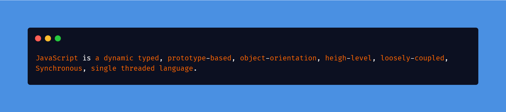

# 🚀 Ultimate JavaScript Interview Playbook

## 🧠 What is JavaScript?

**JavaScript** is a **high‑level**, **interpreted (JIT‑compiled)**, **dynamically & weekly typed**, **multi‑paradigm**, **prototype‑based**, **single‑threaded**, **event‑driven** language for building **web**, **mobile**, and **server‑side** applications.

It supports **object‑oriented**, **functional**, and **imperative** styles, and runs:

- In browsers via engines like **V8**, **SpiderMonkey**, **JavaScriptCore**
- On servers via **Node.js** (V8)

---

## 📚 Table of Contents

- [🚀 Ultimate JavaScript Interview Playbook](#-ultimate-javascript-interview-playbook)
  - [🧠 What is JavaScript?](#-what-is-javascript)
  - [📚 Table of Contents](#-table-of-contents)
  - [🎯 Beginner Level](#-beginner-level)
    - [🔧 Core Characteristics](#-core-characteristics)
  - [🌍 Execution Environment](#-execution-environment)
    - [Browser Engines](#browser-engines)
    - [Server Runtime](#server-runtime)
    - [📦 Data Types \& Coercion](#-data-types--coercion)
    - [🔍 Scopes \& Closures](#-scopes--closures)
  - [⚡ Intermediate Level](#-intermediate-level)
    - [🔄 Asynchronous JavaScript](#-asynchronous-javascript)
    - [🏗️ Object System](#️-object-system)
    - [📅 Date \& Time](#-date--time)
    - [🌐 Browser APIs](#-browser-apis)
    - [🖥️ Node.js Concepts](#️-nodejs-concepts)
  - [🚀 Advanced Level](#-advanced-level)
    - [🧩 Advanced Internals](#-advanced-internals)
    - [📈 Memory \& Performance](#-memory--performance)
    - [🛠️ Advanced Patterns \& Techniques](#️-advanced-patterns--techniques)
    - [🧪 Testing, Debugging \& Tooling](#-testing-debugging--tooling)
    - [🌟 ES6 → ES2025 Highlights](#-es6--es2025-highlights)
  - [🌍 Where JavaScript Is Used](#-where-javascript-is-used)
  - [🧪 JS Quiz Practice \& Resources](#-js-quiz-practice--resources)
    - [🔗 Beginner Resources](#-beginner-resources)
    - [🔗 Intermediate Resources](#-intermediate-resources)
    - [🔗 Advanced Resources](#-advanced-resources)
    - [Design Patterns](#design-patterns)
    - [🔗 React \& Framework Resources](#-react--framework-resources)
  - [💬 Discussion \& Issues](#-discussion--issues)
  - [🙌 Contribution \& License](#-contribution--license)

---

## 🎯 Beginner Level

### 🔧 Core Characteristics

- **Dynamically Typed**: Variables are not bound to a specific type.
- **Weekly Typed**: Type coercion is allowed between incompatible types.
- **Prototype-based Inheritance**: Objects can inherit directly from other objects.
- **Single-threaded with Event Loop**: Uses **call stack**, **callback queue**/**task queue**/**macrotask queue**, and **microtask queue** to manage concurrency.
- **Lexical Scoping & Closures**: Functions have access to the scope in which they were defined.
- **Garbage Collected**: Automatic memory management.
- **JIT Compiled**: Modern JS engines (V8, SpiderMonkey) optimize execution using Just-in-Time compilation.

---

## 🌍 Execution Environment

### [Browser Engines](https://zoo.js.org/)

- **V8** (Chrome, Edge)
- **SpiderMonkey** (Firefox)
- **JavaScriptCore** (Safari)

### Server Runtime

- **Node.js** (V8)
- APIs: modules, streams, clusters, process, filesystem

---

### 📦 Data Types & Coercion

- Primitive vs Reference types
- Primitive types: Number, String, Boolean, null, undefined, Symbol, BigInt
- Non-primitive: Object, Array, Function
- `==` vs `===`, truthy/falsy
- Type conversions & `typeof`, `instanceof`, `Object.prototype.toString.call()`

### 🔍 Scopes & Closures

- Execution context: global, function, eval
- Scope chain and lexical scope
- Function scope vs block scope
- Closures: memory, use cases, leaks
- IIFE (Immediately Invoked Function Expression)
- Variables: `var` / `let` / `const`
- Hoisting & Temporal Dead Zone (TDZ)
- Scopes & Lexical Environment
- `this`, `eval()`, `with` statement
- Primitive vs Reference types
- Shallow vs Deep copy
- Strict mode
- The `this`, `window` keyword
- Closures, IIFE
- call, bind, apply

## ⚡ Intermediate Level

### 🔄 Asynchronous JavaScript

- Callbacks & Promises
- `Promise.all`, `Promise.race`, `Promise.any`
- Promises: chaining, error handling
- `async/await`: syntax, error flow, parallel execution
- Call Stack & Heap
- Event Loop & Task Queues
- Microtasks vs Macrotasks

### 🏗️ Object System

- Object creation: literals, constructors, `Object.create`
- Prototypes vs ES6 Classes
- Prototypes and prototype chaining
- `__proto__` vs `prototype`
- ES6 Classes vs constructor functions
- Inheritance patterns: classical vs prototypal

### 📅 Date & Time

- **Core Date Object**: 4 creation ways, Epoch time, Unix timestamps.
- **Getters/Setters**: The 0‑indexed month trap, day‑of‑week logic.
- **Date Arithmetic**: Adding/subtracting time (DST awareness), leap years.
- **Internationalization (Intl)**: `Intl.DateTimeFormat`, `RelativeTimeFormat`, `formatRange`, `formatToParts`.
- **Best Practices**: Storing UTC (ISO‑8601) vs. Rendering Local time.

### 🌐 Browser APIs

- DOM traversal & manipulation
- Events: bubbling, capturing,
- `addEventListener` vs inline handlers
- LocalStorage, SessionStorage, cookies
- Fetch API, XMLHttpRequest
- Web APIs: Geolocation, Notifications, History API

### 🖥️ Node.js Concepts

- Modules: CommonJS vs ES Modules
- Global objects: `process`, `__dirname`, `__filename`
- EventEmitter
- `EventEmitter`, Streams, Buffers
- OS, Process, Cluster, File System
- File system, Path module
- Async patterns in Node.js

## 🚀 Advanced Level

### 🧩 Advanced Internals

| Concept                  | Details                                              |
| ------------------------ | ---------------------------------------------------- |
| **Call Stack**           | Function execution contexts (LIFO)                   |
| **Heap**                 | Dynamic memory allocation                            |
| **Event Loop**           | Manages callbacks, timers, Promises                  |
| **Micro vs Macro Tasks** | Promise callbacks vs `setTimeout`/I/O                |
| **Execution Context**    | Creation (scope, hoisting, `this`) + execution       |
| **Hoisting**             | Declarations moved to top of scope                   |
| **Closures**             | Inner functions retain access to outer scope         |
| **`this`**               | Determined by call‑site & strict/non‑strict mode     |
| **Scope Chain**          | Lexical scope lookup                                 |
| **Memory Leaks**         | Unreleased closures, event listeners, DOM references |
| **Shadowing & TDZ**      | Block scope with `let`/`const` before initialization |

### 📈 Memory & Performance

- Garbage Collection (Mark‑and‑Sweep)
- Memory leaks: closures, DOM references, timers, Detecting & avoiding memory leaks
- Performance profiling (DevTools)

### 🛠️ Advanced Patterns & Techniques

- Currying, Partial Application
- Debounce & Throttle
- Function Composition
- Memoization
- Module pattern, Revealing Module, Singleton patterns
- Factory vs Constructor pattern
- Pub/Sub and Observer pattern

### 🧪 Testing, Debugging & Tooling

- Chrome DevTools: breakpoints, performance monitor
- `debugger` keyword
- Unit testing with Jest, Mocha
- Static analysis: ESLint, Prettier
- Bundlers: Webpack, Vite, Parcel
- Transpilers: Babel

### 🌟 ES6 → ES2025 Highlights

- **Block‑scoped** `let`, `const`
- **Arrow functions** & lexical `this`
- **Template literals** & tagged templates
- **Destructuring** & **spread/rest** operators
- **Modules** (`import` / `export`)
- **Promises**, **async/await**, **top‑level await**
- **Classes** (syntactic over prototypes)
- **Optional chaining** (`?.`), **nullish coalescing** (`??`)
- **BigInt**, **globalThis**, **WeakRef**, **Promise.allSettled**, etc.
- **Temporal API** (Modern date handling proposal)

---

## 🌍 Where JavaScript Is Used

| Domain           | Examples                                  |
| ---------------- | ----------------------------------------- |
| **Frontend**     | React, Vue, Angular                       |
| **Backend**      | Node.js, Express, Nest.js                 |
| **Mobile**       | React Native, NativeScript                |
| **Desktop**      | Electron, Tauri                           |
| **Automation**   | Puppeteer, Playwright, Deno               |
| **AI & ML**      | TensorFlow.js, ONNX.js                    |
| **Edge Compute** | Cloudflare Workers, Vercel Edge Functions |

---

## 🧪 JS Quiz Practice & Resources

Practice these key concepts to solidify your understanding:

- Global, Block, Function Scope
- Lexical Scope, Shadowing, TDZ
- Module vs Script scope

### 🔗 Beginner Resources

- [The Modern JavaScript Tutorial](https://javascript.info/) - In-depth beginner to advanced guide
- [JavaScript Tutorial](https://www.wscubetech.com/resources/javascript) - Comprehensive beginner guide
- [JSkatas](https://jskatas.org) - Interactive JavaScript exercises
- [TypeOfNaN JavaScript Quiz](https://quiz.typeofnan.dev) - Fun quizzes on basics
- [JavaScript is Weird](https://jsisweird.com) - Quirks and edge cases

### 🔗 Intermediate Resources

- [Prep](https://www.frontprep.com/javascript-coding) - Coding interview prep
- [FrontendGeeks](https://www.frontendgeek.com/frontend-interview/javascript-interview) - Frontend interview questions
- [Date & Time Mastery Guide](./Date/README.md) - **(Internal)** Full 0-100 masterclass.
- [JavaScript Interview Questions](https://javascript-questions.vercel.app) - Curated questions
- [JavaScript Questions by Lydia Hallie](https://github.com/lydiahallie/javascript-questions) - In-depth explanations
- [CodeChef JavaScript Skill Test](https://www.codechef.com/skill-test/javascript) - Skill assessment
- [Advanced JavaScript Quiz](https://server2client.com/jsquiz/jsadvancedquiz.html) - Advanced concepts quiz
- [JavaScript Date Master](https://jsdate.wtf) - Date handling challenges
- [Codewars](https://www.codewars.com/dashboard) - Kata challenges
- [BFE.dev](https://bigfrontend.dev/problem) - Big Frontend Dev problems
- [Greatfrontend](https://www.greatfrontend.com/questions) - High-quality frontend questions

### 🔗 Advanced Resources

- [JavaScript Challenge #11](https://app.testdome.com/screening/challenge/11) - TestDome challenge
- [JavaScript Challenge #13](https://app.testdome.com/screening/challenge/13) - TestDome challenge
- [JavaScript Challenge #14](https://app.testdome.com/screening/challenge/14) - TestDome challenge
- [JavaScript Challenge #15](https://app.testdome.com/screening/challenge/15) - TestDome challenge
- [JavaScript Challenge #17](https://app.testdome.com/screening/challenge/17) - TestDome challenge
- [JavaScript engines zoo](https://github.com/ivankra/javascript-zoo)
- [risingstars js](https://risingstars.js.org/)

### Design Patterns

- [Design Patterns](https://github.com/kumaratul60/design-patterns)

### 🔗 React & Framework Resources

- [React JS Interview Questions](https://www.greatfrontend.com/blog/top-30-reactjs-interview-questions-and-answers) - Top React questions
- [Top ReactJS Interview Questions](https://github.com/greatfrontend/top-reactjs-interview-questions) - GitHub repo
- [React Interview Questions](https://github.com/sudheerj/reactjs-interview-questions) - Comprehensive list

---

## 💬 Discussion & Issues

Have questions, or want to dive deeper? Use the [Issues](https://github.com/kumaratul60/javascript-interview/issues/new) tab to:

📌 Suggest new topics or resources

🐛 Report errors

💡 Propose improvements

We encourage open discussion—everyone’s contribution makes this kit better!

## 🙌 Contribution & License

> Want to help others **ace** their **JavaScript interviews**?
> Contributions in the form of questions, explanations, or improvements are welcome!

Feel free to **contribute** questions, answers, explanations or improvements via [**pull requests**](https://github.com/kumaratul60/javascript-interview/pull).

Licensed under **MIT © Atul Kumar Awasthi**.
